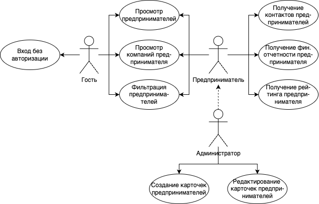
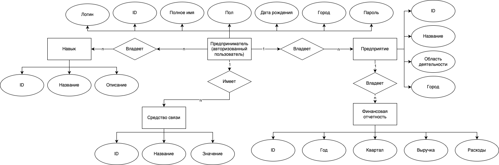

# ППО - Сервис поиска контрагентов

## Краткое описание идеи проекта

Данное приложение предоставляет возможность составления рейтингов предпринимателей, основываясь на различных параметрах фильтрации, с целью отбора подходящих кандидатов для партнерства. Каждый предприниматель имеет список предприятий, к которым он имеет отношение, с указанием собственной доли. Есть возможность определения уровня влияния предпринимателя в той или иной сфере на основании компаний в его портфеле.

## Краткое описание предметной области

Предметная область - предприниматели.

## Краткий анализ аналогичных решений по минимум 3 критериям

Критерии:  
1. Просмотр списка предприятий предпринимателя.
2. Просмотр рейтинга предпринимателя.
3. Поиск предпринимателей по различным параметрам.

Решение                                          | 1 | 2 | 3 |
------------------------------------------------ | - | - | - |
[PartnerSearch](https://www.partnersearch.ru/)   | - | - | - |
[Точка Нетворк](https://tochka.com/rko/network/) | - | + | + |
[Intch](https://intch.org/)                      | - | + | + |
Предлагаемое решение                             | + | + | + |

## Краткое обоснование целесообразности и актуальности проекта

Некоторые предприниматели в поиске потенциальных партнеров сталкиваются с проблемой отсутствия обширной информации о присутствии тех или иных контрагентов в интересующей их сфере. Данное приложение призвано помочь найти людей и способы связи с ними для осуществления дальнейшей совместной коммерческой деятельности.

## Краткое описание акторов

### Гость 

Возможности:
- просмотр списка предпринимателей;
- просмотр списка компаний в портфеле предпринимателя;
- составление рейтингов предпринимателей на основании параметров фильтрации.

Не требует авторизацию.

### Предприниматель

Возможности:
- всё, что гость;
- получение контактов других предпринимателей;
- получение информации об оценке влияния других предпринимателей в некоторой сфере;
- получение финансовой отчетности о деятельности предпринимателя.

Требует авторизацию.

### Администратор

Возможности:
- всё, что предприниматель;
- создание карточек предпринимателей;
- редактирование информации о предпринимателях.

Требует авторизацию.

## Use-Case диаграмма

## ER-диаграмма

## Пользовательские сценарии

1. Гость зашел на главную страницу, с помощью фильтров ограничил выборку и получил список подходящих предпринимателей.

2. Предприниматель (авторизованный пользователь) перешел на главную, с помощью фильтров ограничил выборку, перешел на личную карточку первого предпринимателя и увидел его финансовую отчетность.

3. Гость открыл вкладку авторизации и стал авторизованным пользователем.

4. Администратор открыл панель редактирования карточек и изменил контактные данные предпринимателя Х.

5. Администратор создал личную карточку предпринимателя.

## Формализация ключевых бизнес-процессов

